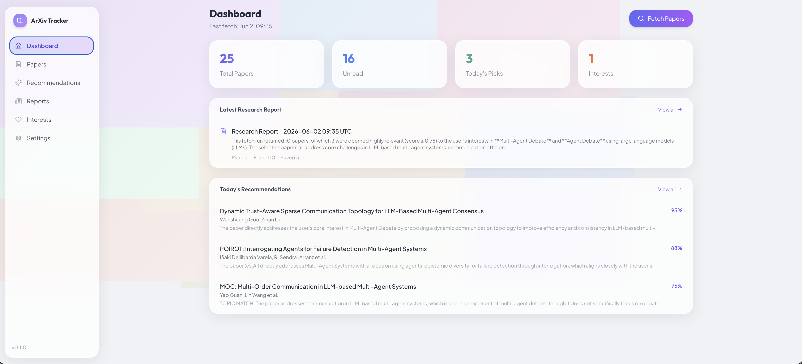
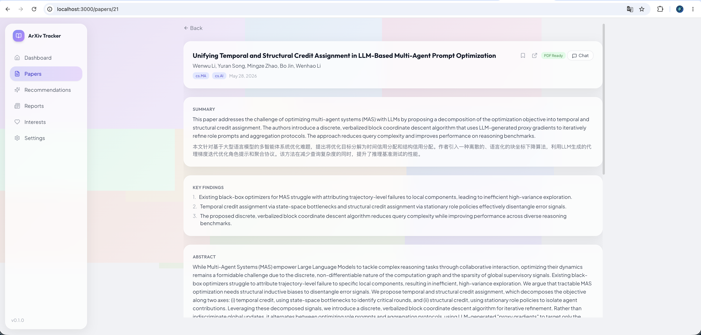

# ArXiv Tracker Agent

> **If you find this project helpful, please give it a ⭐ Star! Your support is my motivation to keep improving.**

AI-powered arXiv paper tracking, recommendation, and paper Q&A system with a LangGraph StateGraph workflow, hybrid RAG retrieval, and optional VLM-enhanced PDF parsing.




English | [中文](README_CN.md)

## Features

- **Autonomous Paper Agent** - Deterministic LangGraph StateGraph workflow that automatically discovers, analyzes, and saves papers with multiple fallback strategies
- **Smart Paper Discovery** - Search arXiv based on your research interests with configurable date range and multiple search strategies
- **Topic Explorer** - Explore a new research topic from a natural-language query, stream progress over WebSocket, and save selected papers
- **AI Summarization** - Generate summaries, key findings, and Chinese translations via OpenAI-compatible or Anthropic API
- **Semantic Recommendations** - Vector-based paper matching using OpenAI-compatible embeddings, with DashScope as the default example
- **Research Reports** - Generate a persistent Markdown research report after every manual or scheduled fetch
- **Hybrid Paper Q&A** - Manually download a paper PDF, then ask questions with semantic vector retrieval, BM25 keyword retrieval, RRF reranking, and full-text fallback
- **Docling + VLM Captioning** - Parse PDFs with Docling and optionally caption tables/figures through an OpenAI-compatible VLM before chunking
- **Real-time Progress** - WebSocket-powered live updates during paper fetching
- **Paper Management** - Bookmark, mark as read, filter, batch delete papers
- **LangSmith Observability** - Full tracing of agent decisions and LLM calls
- **Automatic Fallbacks** - LLM failures fall back to local scoring; API timeouts retry with exponential backoff
- **Weekly Cleanup** - Automatic cleanup of old read, unbookmarked papers

## Quick Start

> ⚠️ **Designed for macOS.**

### Prerequisites

- macOS
- Python 3.11+
- Node.js 18+
- [uv](https://docs.astral.sh/uv/getting-started/installation/)

### Local Setup

```bash
git clone git@github.com:gaoweijun5/arxiv-tracker-agent.git
cd arxiv-tracker-agent
make setup
```

This will create `.env`, install all dependencies, and create data directories.

### Configuration

```env
# === LLM API ===
# Provider: "openai" (DeepSeek/OpenAI-compatible) or "anthropic"
LLM_PROVIDER=openai

# OpenAI-compatible (DeepSeek, OpenAI, etc.)
OPENAI_API_KEY=sk-your-api-key-here
OPENAI_API_BASE=https://api.deepseek.com
LLM_MODEL=deepseek-v4-flash
# Optional: use a separate tool-call-capable model for Fetch Papers agent.
# Recommended if your main model is a reasoning model such as deepseek-reasoner.
# LLM_AGENT_MODEL=deepseek-v4-flash

# Anthropic API 
# ANTHROPIC_API_KEY=sk-ant-your-key-here
# ANTHROPIC_MODEL=claude-sonnet-4-20250514

# === Embedding API ===
# Any OpenAI-compatible embedding API works (DashScope, DeepSeek, OpenAI, etc.)
EMBEDDING_API_KEY=sk-your-embedding-key
EMBEDDING_API_BASE=https://dashscope.aliyuncs.com/compatible-mode/v1
EMBEDDING_MODEL=text-embedding-v4

# === VLM Caption API ===
# OpenAI-compatible chat completions endpoint used to caption Docling tables/figures.
# Optional; enables table/figure captions during PDF parsing.
# VLM_API_KEY=sk-your-vlm-api-key
# VLM_API_ENDPOINT=https://api.openai.com/v1
# VLM_MODEL=gpt-4o-mini
# VLM_IMAGE_SCALE=2.0

# === Optional ===
LANGSMITH_API_KEY=your-langsmith-key
LANGSMITH_PROJECT=Agent

# === Advanced (defaults are fine) ===
# DATABASE_URL=sqlite+aiosqlite:///./data/arxiv_tracker.db
# CHROMA_PERSIST_DIR=./data/vectors
# ARXIV_MAX_RESULTS=50
# ARXIV_PAGE_SIZE=10
# ARXIV_REQUEST_INTERVAL_SECONDS=3
# ARXIV_MAX_RETRIES=2
# ARXIV_RATE_LIMIT_BACKOFF_SECONDS=60
# ARXIV_REQUEST_TIMEOUT_SECONDS=90
# ARXIV_USER_AGENT="arxiv-tracker-agent/0.1.0 (mailto:your-email@example.com)"
# RAG_CHUNK_TOP_K=8
# RAG_RETRIEVAL_CANDIDATES=20
# RAG_CONFIDENCE_THRESHOLD=0.65
# RAG_RRF_K=60
# DAILY_FETCH_HOUR=8
# DAILY_FETCH_MINUTE=0
```

`ARXIV_USER_AGENT` should identify your app and include a contact email or project URL. The default crawler is conservative: arXiv API and PDF requests are serialized, spaced at least 3 seconds apart, search pages are capped at 10 records, and 403/429 responses trigger a longer shared backoff.

### Local Run

```bash
make dev
```

This starts both backend (http://localhost:8000) and frontend (http://localhost:3000). The project runs locally through `make`.

Other commands:
- `make backend` - Start backend only
- `make frontend` - Start frontend only
- `make clean` - Clean generated files

## Usage

### 1. Add Research Interests

Go to **Interests** page and add your research topics with keywords and arXiv categories.

### 2. Explore a Topic

Use **Explore a Topic** on the Dashboard to try a natural-language research direction before adding it as a long-term interest:
- Enter a research question or topic description
- The explorer expands keywords, searches arXiv, analyzes candidate papers, and streams progress over WebSocket
- Save useful papers directly into your collection

### 3. Fetch Papers

Click **Fetch Papers** on Dashboard or Settings page:
- Select specific topics to search
- Choose search period (1-30 days)
- Set max results per topic
- The autonomous agent will search, analyze, and save paper metadata automatically
- Use the download button on a paper detail page when you need paper Q&A
- A research report is generated after each fetch and saved under **Reports**
- Watch real-time progress via WebSocket

### 4. Browse Papers

**Papers** page shows all fetched papers in a table:
- Filter by All / Unread / Bookmarked
- Sort by Date or Score
- Select multiple papers for batch delete
- View AI-generated summaries
- Click to read full details and ask questions

### 5. Paper Q&A

On paper detail page, click **Chat** to open the Q&A sidebar:
- Click the download button first to make the paper **PDF Ready**
- Ask questions about the paper
- The backend parses the PDF with Docling, optionally captions tables/figures with a VLM, and stores paragraph-aware chunks
- Q&A first uses hybrid chunk retrieval (semantic vectors + BM25 + RRF); if confidence is low, it falls back to full paper context reconstructed from chunks
- Retrieved source chunks and confidence scores are shown when chunk-level retrieval is used
- Conversation history is saved
- Clear chat history with the trash icon

## Troubleshooting

**Fetch returns 0 papers or fails**

arXiv API rate limiting (HTTP 429) can cause empty or failed fetches. If you've been testing frequently, wait 10-30 minutes before trying again. The system serializes arXiv traffic, waits at least 3 seconds between requests, and backs off after 403/429 responses.

**Fetch fails with `'str' object has no attribute 'model_dump'`**

This usually means the OpenAI-compatible LLM endpoint failed during agent tool calling. Set a tool-call-capable fetch model, for example `LLM_AGENT_MODEL=deepseek-v4-flash`. The backend also falls back to a sequential compatibility workflow for this provider-side error.

**Q&A asks for PDF download**

Paper Q&A is local-first. Click the download button on the paper detail page first; the backend will download the PDF, parse it with Docling, create chunks, and sync them to SQLite FTS5 and ChromaDB.

**Table or figure captions are missing in Q&A**

Set `VLM_API_KEY`, `VLM_API_ENDPOINT`, and `VLM_MODEL` to enable OpenAI-compatible table/figure captioning during PDF parsing.

## Architecture

```
┌─────────────────────────────────────────────────────────────┐
│                    Frontend (React)                          │
│ Dashboard | Topic Explorer | Papers | Reports | Settings    │
└─────────────────────────┬───────────────────────────────────┘
                          │ HTTP + WebSocket
                          ▼
┌─────────────────────────────────────────────────────────────┐
│                    Backend (FastAPI)                          │
│ Papers | Conversations | Reports | Explore | System | WS    │
└─────────────────────────┬───────────────────────────────────┘
                          │
        ┌─────────────────┼─────────────────┐
        ▼                 ▼                 ▼
┌───────────────┐ ┌───────────────┐ ┌───────────────┐
│  LangGraph    │ │   Services    │ │   Storage     │
│               │ │               │ │               │
│ - Paper Agent │ │ - arXiv API   │ │ - SQLite      │
│ (StateGraph)  │ │ - LLM API     │ │ - FTS5 chunks │
│ - Topic       │ │ - Docling PDF │ │ - ChromaDB    │
│   Explorer    │ │ - VLM Caption │ │ - Local PDFs  │
│               │ │ - Hybrid RAG  │ │               │
└───────────────┘ └───────────────┘ └───────────────┘
                          │
                          ▼
                   ┌─────────────┐
                   │  LangSmith  │
                   │  (Tracing)  │
                   └─────────────┘
```

### PDF & RAG Q&A Pipeline

Paper Q&A uses a local hybrid retrieval pipeline:

```
Download PDF
  ▼
Docling parse
  ▼
Optional VLM captioning for tables/figures
  ▼
Paragraph-aware chunks
  ▼
SQLite FTS5 + ChromaDB
  ▼
Semantic retrieval + BM25 retrieval
  ▼
RRF reranking + confidence check
  ▼
Answer with source chunks, or fall back to full paper context
```

If VLM captioning is configured, table and figure captions are inserted back into the parsed document before chunking so visual content can participate in retrieval.

### Paper Agent (StateGraph Workflow)

The Paper Agent uses LangGraph's `StateGraph` to implement a deterministic paper discovery workflow with automatic fallback mechanisms:

```
User: "Fetch Papers"
  │
  ▼
┌─────────────────────────────────────────────────────────────┐
│              StateGraph Workflow (Deterministic)              │
│                                                              │
│  ┌──────────────┐    ┌──────────────────┐    ┌────────────┐ │
│  │ Load Context │───▶│ Build Query Plan │───▶│ Search Loop│ │
│  │              │    │                  │    │            │ │
│  │ • Interests  │    │ • Primary search │    │ • Execute  │ │
│  │ • Feedback   │    │ • Category only  │    │   searches │ │
│  └──────────────┘    │ • Keyword only   │    │ • Fallback │ │
│                      │ • Expanded days  │    │   strategies│ │
│                      └──────────────────┘    └─────┬──────┘ │
│                                                    │        │
│                                                    ▼        │
│  ┌──────────────┐    ┌──────────────────┐    ┌────────────┐ │
│  │  Save Loop   │◀───│  LLM Analysis    │◀───│ Local Score│ │
│  │              │    │                  │    │            │ │
│  │ • Save to DB │    │ • Generate summary│    │ • Keyword  │ │
│  │ • Update     │    │ • Check relevance │    │   matching │ │
│  │   vectors    │    │ • Fallback if    │    │ • Category │ │
│  └──────┬───────┘    │   LLM fails      │    │   matching │ │
│         │            └──────────────────┘    └────────────┘ │
│         ▼                                                    │
│  ┌──────────────┐    ┌──────────────────┐                    │
│  │  Finalize    │───▶│  Generate Report │                    │
│  │              │    │                  │                    │
│  │ • Stats      │    │ • LLM-generated  │                    │
│  │ • Errors     │    │ • Fallback       │                    │
│  │ • Fallbacks  │    │   template       │                    │
│  └──────────────┘    └──────────────────┘                    │
└─────────────────────────────────────────────────────────────┘
```

**Key Features:**
- **Deterministic Flow**: Predefined node sequence for stable execution
- **Multiple Search Strategies**: Each interest generates 4-6 search attempts with different parameters
- **Local Scoring**: Fast keyword/category matching before expensive LLM analysis
- **Automatic Fallbacks**: LLM failures fall back to local scoring; timeouts retry with exponential backoff
- **Rate Limit Handling**: Automatic backoff on 429/403 responses from arXiv API

## License

MIT
